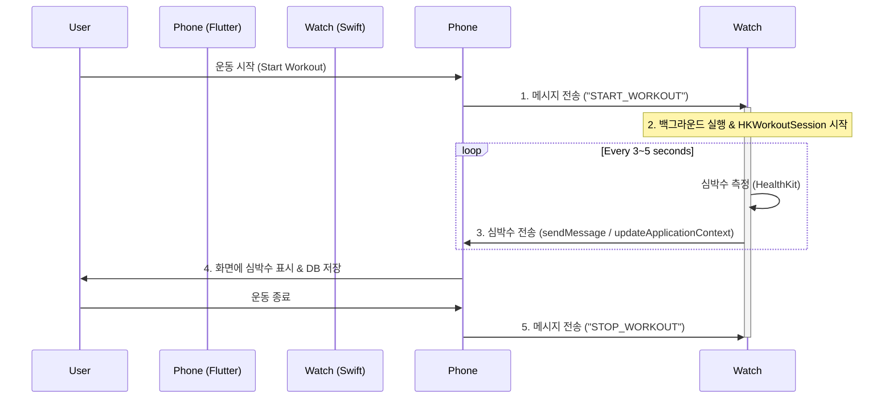

# ⌚ Watch Connectivity & Heart Rate Streaming 전략

## 🎯 목표
**"스마트폰에서 운동을 시작해도 Apple Watch로부터 실시간 심박수를 가져온다."**

사용자의 요구사항은 **Phone-Initiated Workout** 시나리오입니다. 사용자는 폰을 조작하고, 워치는 수동적인 심박수 센서 역할만 수행합니다.

## ⚠️ 기술적 필수 전제 (중요)
Apple의 보안 및 배터리 정책상, iOS 앱이 독단적으로 Watch의 센서를 켤 수 없습니다.
**반드시 Watch에 설치된 "Companion App"이 있어야 하며, 이 앱이 실행되어야 심박수를 보낼 수 있습니다.**

따라서 "Watch App은 추후 개발"이라는 요구사항을 **"복잡한 UI를 가진 독립형 Watch App은 나중에 만들고, 지금은 심박수 셔틀 역할만 하는 최소 기능의 Watch App을 만든다"**로 해석하여 진행합니다.

---

## 🏗️ 아키텍처: "Sensor Mode"

### 1. 데이터 흐름

### 2. 컴포넌트 역할

#### 📱 iOS (Flutter)
- **`WatchConnectivityService`**: 
  - `watch_connectivity` 패키지 사용.
  - Watch로 `START`/`STOP` 커맨드 전송.
  - Watch로부터 들어오는 심박수 데이터 스트림 수신 (`StreamController`).
- **`WorkoutTrackingService`**:
  - 기존 GPS 트래킹 로직에 심박수 데이터 병합.

#### ⌚ WatchOS (Swift - Native)
- **UI**: 거의 없음 (현재 심박수만 보여주는 단순 텍스트, 또는 "Phone에서 제어 중" 문구).
- **`WCSessionDelegate`**: 폰의 명령 수신.
- **`HKWorkoutSession`**: 
  - **핵심**: 이 세션을 열어야만 Watch가 화면이 꺼져도 백그라운드에서 심박수를 계속 측정하고 전송할 수 있음.
  - 운동 모드: `Running`, `Strength` 등 폰과 매핑.

---

## 📅 구현 단계 (Implementation Steps)

### Step 1: Flutter 환경 설정 (즉시 가능)
- `pubspec.yaml`에 `watch_connectivity` 활성화.
- `lib/services/watch_connectivity_service.dart` 구현.

### Step 2: Xcode Watch 타겟 추가 (필수)
- **가장 위험한 단계**: `project.pbxproj` 수정이 일어나므로 백업 필수.
- Xcode에서 `File > New > Target > Watch App for iOS App` 선택.
- Bundle ID: `com.jared.pacelifter.watchkitapp`.

### Step 3: WatchOS 네이티브 로직 구현 (Swift)
- **`ConnectivityProvider.swift`**: 폰과의 통신 담당.
- **`WorkoutManager.swift`**: HealthKit 세션 관리 및 심박수 쿼리.
- **`ContentView.swift`**: 단순 심박수 표시 UI.

### Step 4: 통합 및 테스트
- 시뮬레이터(iPhone + Watch) 쌍으로 테스트.
- 실제 기기 테스트 (권한 문제 확인).

---

## ✅ 승인 요청
위 전략대로 **"심박수 센서 역할의 최소 기능 Watch Extension"**을 프로젝트에 추가하는 방향으로 진행하시겠습니까?
승인하시면 **Step 1: Flutter 환경 설정**부터 즉시 시작합니다.
